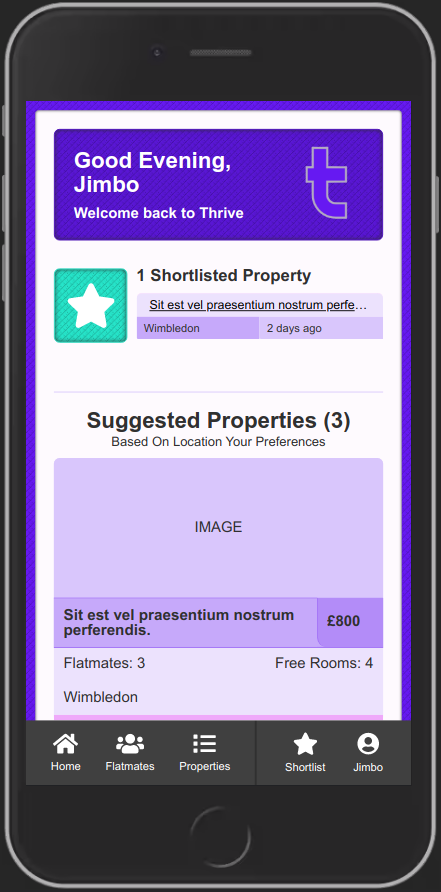

  

  <h1 align="center">🏚️👫 Thrive - Backend</h1>

<h3 align='center'>  
    Find Flatmates, Houseshares, Manage A Household Or Build Your Property Portfolio, All In Once Place.
</h3>

     
    <a href="https://thrive-living.herokuapp.com/"><strong>Visit The Site »</strong></a>
     
     
    <a href="https://github.com/Rhelli/thrive.io-backend/archive/refs/heads/master.zip">Download this repository</a>
    |
    <a href="https://github.com/Rhelli/thrive.io-backend/issues">Report A Bug</a>
    |
    <a href="https://github.com/Rhelli/thrive.io-backend/fork">Fork It</a>
  

## 📑 Table of Contents
  - [The Project Brief](https://github.com/Rhelli/thrive.io-backend#-the-project-brief)
  - [The Technical Requirements](https://github.com/Rhelli/thrive.io-backend#-the-technical-requirements)
  - [How Does It Work?](https://github.com/Rhelli/thrive.io-backend#how-does-it-work)
  - [Application Architecture](https://github.com/Rhelli/thrive.io-backend#%EF%B8%8F-application-architecture)
  - [Tools & Technology Used](https://github.com/Rhelli/thrive.io-backend#-tools--technology-used)
  - [Setup & Use](https://github.com/Rhelli/thrive.io-backend#-setup--use)
  - [Contributions, Issues and Forking](https://github.com/Rhelli/thrive.io-backend#%EF%B8%8F-contributions-issues-and-forking)
  - [Creator](https://github.com/Rhelli/thrive.io-backend#-creator)
  - [Show Your Support!](https://github.com/Rhelli/thrive.io-backend#-show-your-support)
  - [Licensing](https://github.com/Rhelli/thrive.io-backend#%EF%B8%8F-licensing)

## 🔰 The Project Brief

This is the Final capstone project of the Microverse Full-Stack Engineering course, to be completed by all students of [Microverse](https://www.microverse.org/).

Capstone projects are unlike the other projects we complete as student of Microverse in that they are timed, performed under specific stipulation, and created to a business-like specification. However as this is the very last Capstone project of the entire course, the requirements are different this time as well.

For the final capstone project of the course, we are required to build upon the skills we have gathered over the entire span of the full-stack curriculum, and create a truly Full-Stack software experience. This entails building both a Ruby on Rails backend, which will act as out database and a React & Redux front-end, which will act as the interface by which the end user will interact with our application. 

## 🚦 The Technical Requirements
The specifications for this capstone project, was to build a 'Find Your House' application, similar in style to AirBnB. The user would be able to:
 - View a list of nearby properties
 - View the properties profiles
 - Can log in and out of the application and create an account for themselves
 - Can save chosen properties via a type of 'favourites' functionality.

Additional technical specifications (in relation to the front-end) are as follows:
 - The project must be a mobile web app
 - The project's front-end React & Redux system must interact with the back-end via various API calls
 - The user must be able to not only retrieve (GET) information from the back-end but also create (POST), update (PUT) and delete (DELETE).
 - The project must utilise Redux as a means of state management, ideally acting as an intermediatory between the back-end and the front-end.

### How Does It Work?
The application serves three specific purposes:
 1. It allows users to look and find flatmates or flatshares. ([What is a flatshare?](https://dictionary.cambridge.org/dictionary/english/flatshare)).
 2. It allows users to look for flatmates and advertise their homes to share with other tenants.
 3. It allows Landlord or Companies to advertise multiple properties to all users.

The main premise is not an unheard of one, but an idea that is beginning to become more popular in large, expensive cities around the world. Due to the extremely high rental costs in cities, the only sustainable way for individuals to rent properties, is to band together and split the rent. This application facilitates that process.

### User Types
As the application is concerned with either letting users find flatshares or letting users promote their own properties, I split the user base up into two main categories of user:
 - 'Looking' users, i.e. users who are using the application to find a property/flatshare
 - 'Advertising' users, i.e. users who either are looking for a person to join their household, or a user who is simply promoting properties.

Users who are 'looking' for flatshares are a simple, one dimensional model - they are presented with properties who are looking for someone to join them. 'Advertising' users, on the other hand, are split up in to two further categories - Landlords, and Flatmates:
 - Flatmates can only have and manage one household as they are a tenant, just like the other house members and do not own multiple properties
 - Landlords can have and manage multiple properties.

### Information
Moving into a shared household is a big move. It would follow, then, that most people would not make such a move (especially over the internet), unless provided with a wealth of information about the property they would be moving into and the flatmates they would share it with. Therefore, I tried to maximise the varying (and salient) information about the property and its inhabitants in order to make choosing a new flatshare for the user as easy as possible. Ultimately, with this form of service, the less information there is about the property, the less useful this application is.

## ⚙️ Application Architecture
As this repository is the for the back-end system, I will only cover the Ruby on Rails portion of the application here. To see the front-end oriented application architecture, [head here.](https://github.com/Rhelli/thrive.io-frontend)

## File Structure
As the backend for this project utilises Rails working in a strictly API type fashion, a large periphery of Rails utilities are not needed here. Therefore, we are working strictly with Controllers, Models and Routes (amongst others). Additionally, due to this backend being an API style system, we have namespaced all of our controllers uner the /api/v1 namespace.

## Tables
A cursory look at our Schema will show us that we are working with a fairly simple, 3 table database. The column types are fairly varies however the app functions predominately off the Users and the Properties tables. The third table, Shortlists, is a join table and facilitates the saving of properties to 'Looking' users accounts for later reference.

## Serializers
The backend here makes heavy use of the ActiveModelSerializer to format and restrict the information being passed back to the front end. This is especially important with the API style configuration we have here, not only for utility but also for security. Additionally, it allows us to pass back associations, which prove to be useful in more than a couple of places.

## Security
Users are able to create accounts and sign in and out of the application via utilisation of a mix of encrypted passwords and JWT. Passwords are initially encrypted using BCrypt to generate a password hash and salt - passwords are never, at any point, stored in the database in plaintext. This allows users to be authenticated when they next return to the application.

Automatic authentication is also enabled in this application via an Auto-Login method which verifies if the user has a JSON Web Token in their browsers localStorage. This token is initially placed in the users browser memory upon login and will therefore keep the user both logged in whenever they are using the application, as well as authenticated whenever performing a new action (i.e. viewing their profile). If the user logs out of the application at any time, this JWT is destroyed and the user no longer has access to their account.

Additional security has been implemented around performing password changes (the user has to re-verify their password).

## 🔬 Tools & Technology Used
**Languages & Frameworks**
 - Ruby 3.0.0
 - Ruby on Rails 6.1.3.1

**Gems of note**
 - [Faker](https://github.com/faker-ruby/faker)
 - [HIRB](https://github.com/cldwalker/hirb)  (GOAT Award 🥇)

**Database**
 - PostgreSQL

**Linters & Quality Control**
 - [Stickler CI](https://stickler-ci.com/)
 - [Rubocop 0.85.0](https://github.com/rubocop-hq/rubocop-rails)

**Deployment**
 - Heroku

### 💻 Setup & Use
Follow [this link](https://thrive-living.herokuapp.com/) to see a live version of the project. If you'd like a closer look, continue reading....

#### Setup
Setup should be fairly straightforward. You will have to ensure your machine is properly equipped to run the code first:
  1. Make sure you have both [Ruby](https://www.ruby-lang.org/en/documentation/installation/) and Ruby on Rails ([Mac](https://gorails.com/setup/osx/10.15-catalina) • [Linux](https://gorails.com/setup/ubuntu/19.10) • [Windows](https://gorails.com/setup/windows/10)) installed.
  2. Download this repository.
  3. **`cd`** into the root directory of wherever you download this repo. [What does 'cd' mean?](https://www.macworld.com/article/2042378/master-the-command-line-navigating-files-and-folders.html)
  4. Whilst at the root (home) directory of this project, enter **`bundle install`** to install the projects software dependencies.
  5. Now enter **`rails db:create`** to setup the database for the project
  6. Enter **`rails db:migrate`** to create the database information and seed the database.
  7. In your terminal window, enter **`rails server`** to start the server.
  8. Now navigate to **`localhost:3001`** in your browser.
  9. Perform the same 'setup' process with the front-end to see the site hosted locally!

Alternatively, you can also interact with the database by punching in `rails c` into the terminal once at root level.

*******

## 🛎️ Contributions, Issues and Forking

Contributions, issues and feature requests are more than welcome! 

If you have any problems running or setting this project up, please submit it as a bug on the [issues page.](https://github.com/Rhelli/thrive.io-backend/issues) right away!

If you want to make your own changes, modifications or improvements, go ahead and Fork it!
1. [Fork it](https://github.com/Rhelli/thrive.io-backend/fork)
2. Create your working branch (git checkout -b [choose-a-name])
3. Commit your changes (git commit -am 'what this commit will fix/add/improve')
4. Push to the branch (git push origin [chosen-name])
5. Create a new Pull Request

## 💂🏽💻 Creator

Rory Hellier - [Github](https://github.com/Rhelli)

## 🖐🏼 Show Your Support!
Give a ⭐️ if you like this project!

## ⚖️ Licensing
This project is [Privately](https://github.com/Rhelli/thrive.io-backend/blob/master/LICENSE.txt) licensed, Copyrighted and is not intended for free distribution or monetisation without prior permission being obtained from the creator.